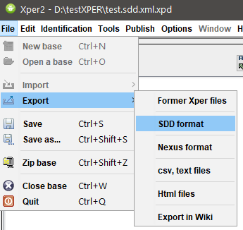

```{r setup, include=FALSE}
knitr::opts_chunk$set(echo = TRUE, message=FALSE, warning=FALSE)
```

# Préparation
## Charger des packages requis

```{r}
# Enlever tout
rm(list = ls())

# Charger des packages
library(XML) 
library(dplyr)
library(stringr)
library(tidyr)
```

## Charger "R-tools for XPER"

C'est le fichier qui contient les fonctions pour lire et analyser la clef XPER2 en format SDD.

```{r}
source("https://raw.githubusercontent.com/nlxbach/nlxbach.github.io/master/XPER/RtoolforXPER.R")
```

## Charger la clef XPER2 en format de SDD (XML)

### Exporter format sdd de Xper2
```{r, echo=FALSE, fig.align='center', out.width = "60%"}

```

Par exemple la clef est nommé "test.sdd.xml". On utilise commandes `read_sdd_xper()` pour lire et sauvegarder à objet `xml_data`.

```{r}
xml_data <- read_sdd_xper(sddfile = "https://raw.githubusercontent.com/nlxbach/nlxbach.github.io/master/XPER/test.sdd.xml")
```

# Afficher les informations générales
## La liste des taxons dans la clef

Utiliser la fonction `get_df_Taxon()` pour exporter la liste des taxons dans la clef à partir d'objet `xml_data`. Le résultat est une table avec une colonne d'id et une colonne d'étiquette du taxon.


```{r eval = FALSE}
get_df_Taxon(xml_data)
```

Dans cet exemple, nous avons 6 espèces:

```{r echo = FALSE}
library(kableExtra)
get_df_Taxon(xml_data) %>% kbl() %>%
  kable_paper("hover", full_width = F)
```

## La liste des caractères - modalités

Utiliser la fonction `get_df_Characters()` pour exporter la liste des caractères et ses modalités. Le résultat est une table avec colonne d'id,  étiquette, type et les modalités de caractères. Les modalités sont présentées par le structure `{id:label}`. 

```{r eval=FALSE}
get_df_Characters(xml_data)
```

Dans cet exemple, nous avons 6 caractères: 4 sont des catégories et 2 sont des quantitatifs.

```{r echo=FALSE}
get_df_Characters(xml_data) %>% kbl() %>%
  kable_paper("hover", full_width = F)
```

## La matrice des caractères
Utiliser la fonction `get_df_Descriptions()` pour exporter la matrice des caractères "taxon x caractère". 

```{r eval=FALSE}
get_df_Descriptions(xml_data)
```


```{r echo=FALSE}
get_df_Descriptions(xml_data) %>% kbl() %>%
  kable_paper("hover", full_width = F)
```


#  L'Analyse de MERGEMOD 
## Resultat de Mergemod

Utiliser la fonction `mergemod()` pour exporter le résultat de l’algorithme de Mergemod pour tous les caractères catégories. Ils sont présentés dans la colonne "state_merge".

```{r}
df_Mergemod <- mergemod(xml_data)
```

```{r echo=FALSE}
df_Mergemod %>% kbl() %>%
  kable_paper("hover", full_width = F)
```

## Trouver une "clique" 

Charger les packages pour faire un graphique réseau. Ce qui permet d'identifier facilement les "cliques"

```{r}
library(igraph) 
library(visNetwork)
```


Prendre le résultat de mergemod d’un caractère. 

Par ex: pour Caractère 'ch06'

```{r}
(res_merge <- df_Mergemod$state_merge[6] %>% 
   str_split(pattern = " ; ") %>% 
   unlist())

```

Créer un graphique réseau pour trouver des cliques.

```{r}
# Convertir res_merge en dataframe pour igraph 
D <- data.frame(value = res_merge) %>%
  tidyr::separate(value, into = c("S1", "S2"), sep = "-")

# Créer un graphique réseau
g1 <- graph_from_data_frame(D, directed = F)

# Plot
plot(g1)
```

Donc, on a 2 options:

* Soit fusionner *s11, s12, s15* et puis *s13, s14*
* Ou, fusionner *s11, s12* et puis *s13, s14, s15*

## Cas compliques

Pour les cas compliqués, une variable a plusieurs modalités et de nombreux couples peuvent fusionner ensemble. C'est difficile pour trouver des cliques. Par. ex.:

```{r}
res_merge <- c('1 - 2', '1 - 3', '1 - 4', '1 - 5', '1 - 6', '1 - 7', '1 - 8', 
               '1 - 9', '1 - 10', '1 - 11', '1 - 12', '1 - 13', '1 - 14', 
               '1 - 15', '1 - 16', '2 - 4', '2 - 5', '2 - 7', '2 - 9', '2 - 12',
               '2 - 13', '2 - 15', '2 - 16', '3 - 4', '3 - 5', '3 - 7', '3 - 9',
               '3 - 10', '3 - 12', '3 - 13', '3 - 14', '3 - 16', '4 - 5', '4 - 6',
               '4 - 7', '4 - 8', '4 - 9', '4 - 10', '4 - 11', '4 - 12', '4 - 13', 
               '4 - 14', '4 - 15', '4 - 16', '5 - 6', '5 - 7', '5 - 8', '5 - 9', 
               '5 - 10', '5 - 11', '5 - 12', '5 - 13', '5 - 14', '5 - 15', '5 - 16', 
               '6 - 7', '6 - 9', '6 - 12', '6 - 13', '6 - 16', '7 - 8', '7 - 9', 
               '7 - 10', '7 - 11', '7 - 12', '7 - 13', '7 - 14', '7 - 15', '7 - 16',
               '8 - 9', '8 - 10', '8 - 12', '8 - 13', '8 - 15', '8 - 16', '9 - 10',
               '9 - 11', '9 - 12', '9 - 13', '9 - 14', '9 - 15', '9 - 16', '10 - 12',
               '10 - 13', '10 - 14', '10 - 15', '10 - 16', '11 - 12', '11 - 13', 
               '11 - 16', '12 - 13', '12 - 14', '12 - 15', '12 - 16', '13 - 14', 
               '13 - 15', '13 - 16', '14 - 16', '15 - 16')

D <- data.frame(value = res_merge) %>%
  tidyr::separate(value, into = c("S1", "S2"), sep = " - ")

gr <- graph_from_data_frame(D, directed = F)

plot(gr)
```


Nous pouvons utiliser la fonction `largest_cliques()` pour trouver la clique plus grande dans le réseau.

```{r}
#'Find largest cliques
(largest <- largest_cliques(gr))
```

Donc, dans cet exemple on a 2 cliques qui sont plus grandes avec 11 modalités peuvent être fusionnés.

Et on peut aussi faire une graphique en mode interactif. Cliquez et déplacez un modalités.

```{r}
#'This is function to plot network graphic with largest clique 
b.visNetwork <- function(gr, largest, number){
  g2 <- toVisNetworkData(gr)
  g2$nodes$group <-"Other"
  g2$nodes$group[largest[[number]]] <- "Clique_largest"
  
  #Plot
  visNetwork(g2$nodes, g2$edges) %>%
    visIgraphLayout() %>%
    visNodes(size = 25, shape = "circle") %>%
    visOptions(selectedBy="group",
              highlightNearest = T,
              nodesIdSelection = F) %>%
    visGroups(groupname = "Clique_largest", color = "orange") %>%
    visInteraction(keyboard = TRUE) %>%
    visLegend()
}
```

Paramètres `number` pour spécifier 1 cliques lorsque nous avons plusieurs cliques plus grandes définies. Dans cet exemple, nous avons 2 cliques, nous pouvons donc choisir `nombre = 1` ou `nombre = 2`


```{r}
# plot first group in largest
b.visNetwork(gr, largest, number = 1)
```


```{r}
# plot first group in largest
b.visNetwork(gr, largest, number = 2)
```


# Les perspectives

Nous pouvons intégrer davantage les algorithmes intéressants dans cette boîte à outils comme: MINSET, MINDESCR, MAKEY ... Et les convertir en un package de R.